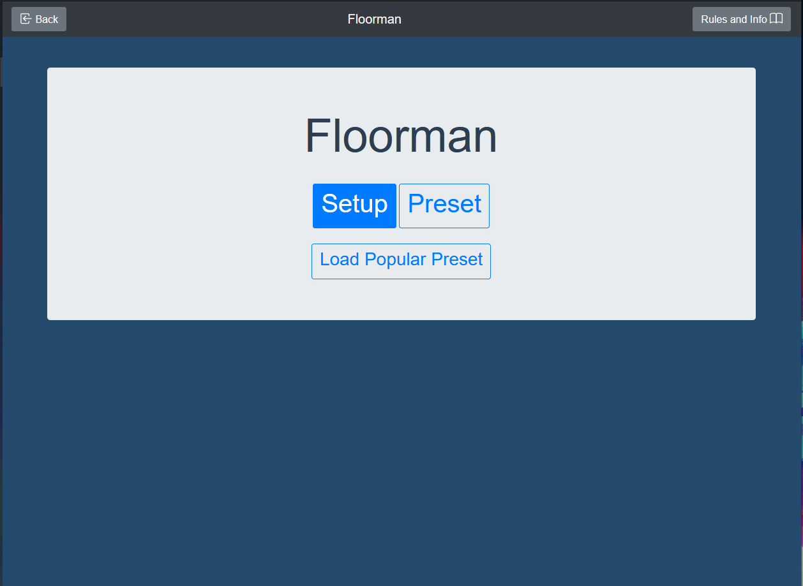
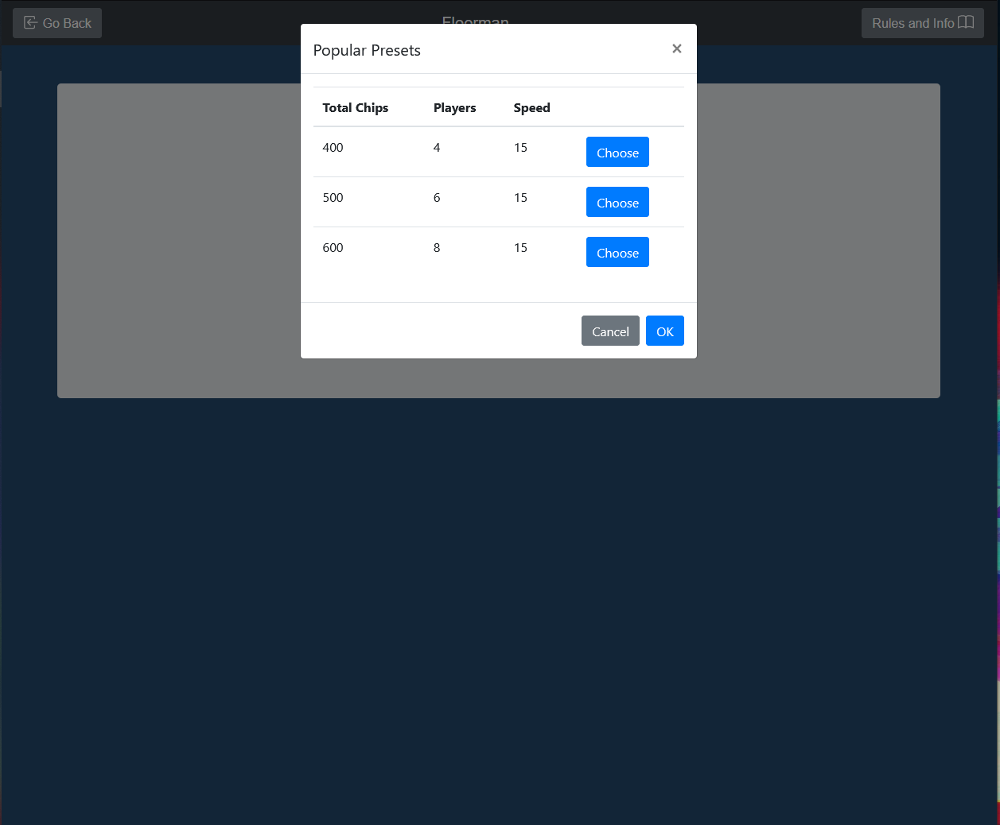
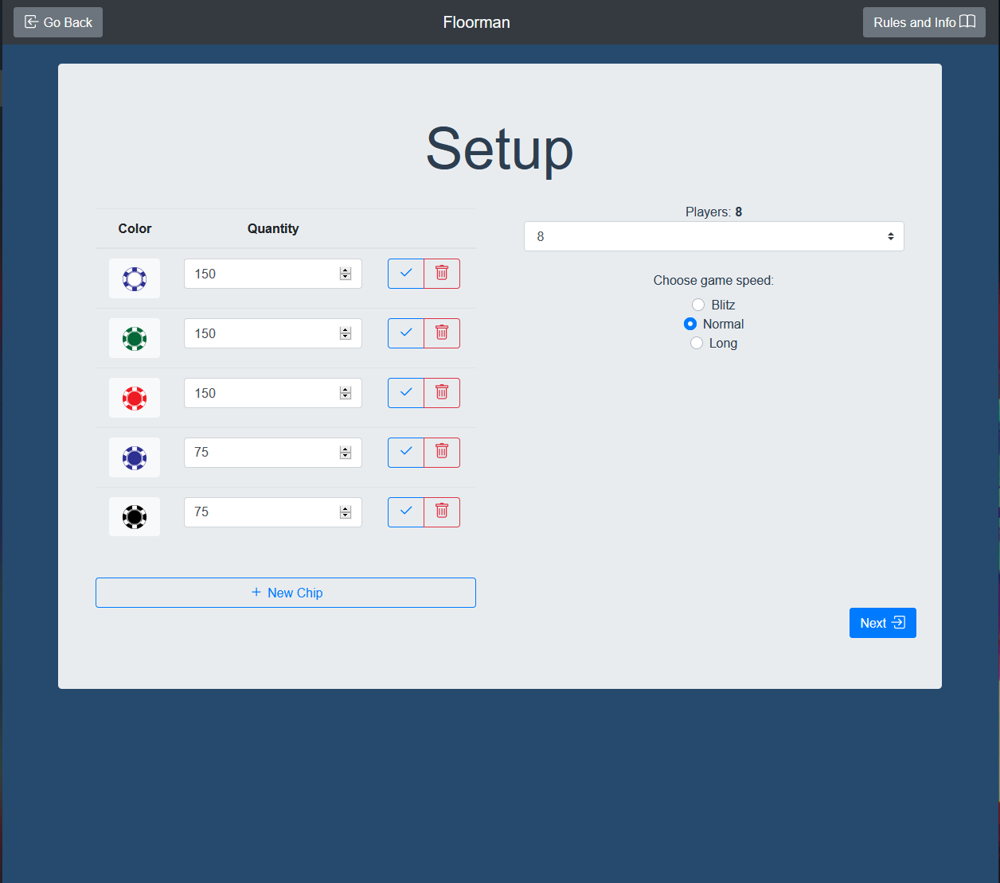
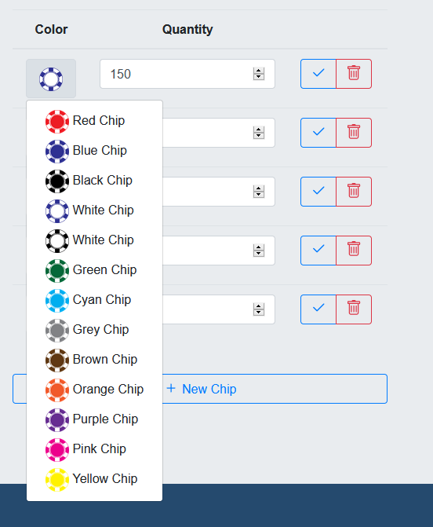
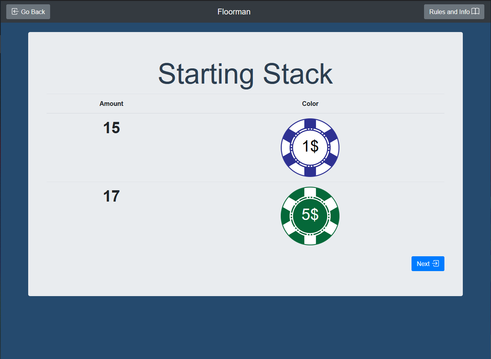
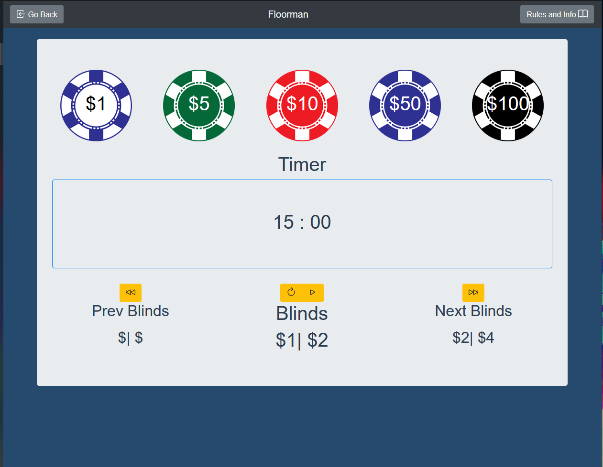

# 371proj - Floorman

## Version 1.0 (1.1 incoming with UI updates and bug fixes)

## Description

In most casinos the term *"Floor"* refers to floorstaff who assist in questions on the rules and oversee important game moments, like an All-In by a player. They work with the dealer to ensure that blinds move up on time, and generally make life as easy for the player as possible. However, this is only in casinos which can afford to pay someone to do this. 

But what about your home poker games? Then this is the app for you! Welcome to Floorman, your digital assistant for a good home poker game.  It serves the simple task of running the clock and upping the blinds on time for you, while displayed all that useful info on the screen. All you need to do is tell it:
1. How many chips you have, and what color they are
2. How many people are playing
3. How fast you would like to play

After you do that, you should be all set to go. Just go to the next page, give each player their starting stack, hit next again, and then start the game! You should see all the chips in the game, including their denomination (value) assigned to them by the engine. 

Enjoy!

## UI

The UI was done with Bootsrap-Vue, a subset of Bootstrap written as Vue components to interact nicely with VueJS.

### Home

### Setup

### Info

### Game

## Functions
- Enter chips, players and speed.
- Get advice on starting stacks for each player
- Keep track of time, and up the blinds
- Allow users to manually cycle the blinds
- Allow users to reset the clock
- Allow users to go back and edit their presets
- Save user preset to the browser for an easier use next time
- Allow user to load from popular presets to save time across machines

## Floorman API
1. You can find it here: github.com//carter-et/floorman-API.
2. It's a simple python server running Flask, with only one method right now.
3. On a GET request, it fetches it's internal data and sends it. No restrictions. If you want it, you got it. It does not handle POSTS or anything else besides an incoming GET.
4. If you would like to pull the presets off of it as well, the url is: https://floorman-api.herokuapp.com/

## Bug List
- The form is not checked for invalid inputs
- The player does not get good feedback if there can be no chips handed out at stacks
- The player does not get notified if the stacks are under 100$
- The UI is kind of unusable at times when the screen size gets really, really small (iPhone 5/SE)
- Not really a bug, but Rules and Info doesn't display anything quite yet. That was never in the scope of the first release, but I can see a lot of players finding it handy. 

## Constraints
- You can only have between 2-8 players. Poker can't be played alone, and a table of 9+ is too crowded. If you have this many people, you should split them off into two tables and run two clocks. Once the total amount of players has reached 8 players, you can have a final table with the remaining players.
- Floorman helps you seperate your chips to each player, but it's engine is still pretty basic. Use your best judgement, and exchange chips for higher values to make your life easier. *Remember: Each person doesn't have to have the same chips, but they do need to have the same starting value as everyone else. It's your choice between giving each person 100 $1 chips or 50 $1 and 5 $10 chips.*
- The user can't push their presets to the API **YET**. This is because presets aren't strictly enforced right now, and if you could push a crap preset, then the popular presets would be overrun with a bunch of junk. 
